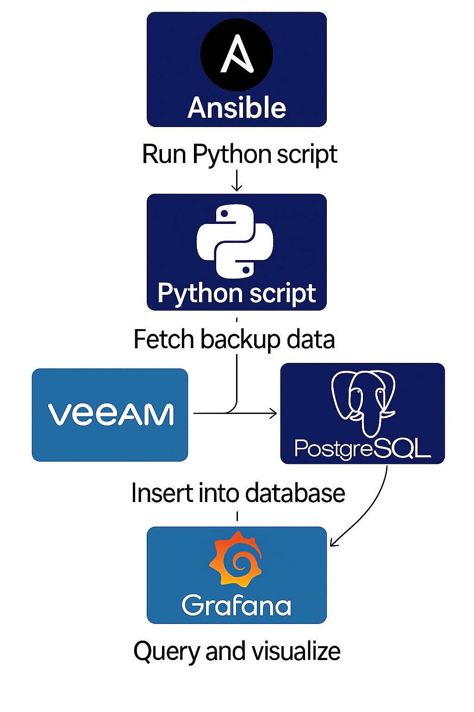

# 📦 Projeto: Monitoramento de Backups Veeam com Python, PostgreSQL e Grafana

Este projeto automatiza a **coleta de dados de backup do Veeam** utilizando **API REST**, com armazenamento em **PostgreSQL** e visualização em **Grafana**, além de integração com o **Redmine para abertura automática de chamados** em caso de falhas ou status relevantes.

---

## 🔄 Fluxo da Solução



1. O **Semaphore** executa uma automação com **Ansible**.
2. O Ansible chama um **script Python** que:
   - Consulta os dados de jobs de backup via **API REST do Veeam**
   - Insere os dados no banco **PostgreSQL**
   - Verifica condições específicas e, se necessário, **abre chamados no Redmine**
3. O **Grafana** se conecta ao PostgreSQL e monta **dashboards dinâmicos** com base nos dados coletados.

---

## 🧩 Tecnologias Utilizadas

- ✅ **Veeam** – origem dos dados (via REST API)
- ✅ **Python** – script de integração e lógica de negócio
- ✅ **PostgreSQL (Alpine 16)** – banco de dados relacional para armazenar as informações
- ✅ **Grafana** – visualização dos dados em dashboards
- ✅ **Ansible + Semaphore** – orquestração da execução
- ✅ **Redmine** – integração para abertura de chamados

---

## 📌 Status do Projeto

- ✔️ Coleta e inserção de dados funcionando com Veeam API
- ✔️ Visualização dinâmica no Grafana
- ✔️ Integração com Redmine ativa
- 🔧 Melhorias futuras:
  - Ajustar métricas ausentes
  - Adicionar novos indicadores úteis

---

## ▶️ Como Executar

1. Configure as variáveis de ambiente no script:
   - Credenciais Veeam API
   - Conexão PostgreSQL
   - Token Redmine

2. Execute via Ansible:

```yaml
- name: Executar script de coleta Veeam
  hosts: localhost
  tasks:
    - name: Rodar script
      command: python3 main.py
```

---
⚠️ Atenção: Todas as credenciais e endpoints sensíveis foram substituídos por valores fictícios neste repositório. 

## 📄 Licença
 
Este projeto é apenas para fins educacionais e demonstração de boas práticas em automação e integração.

